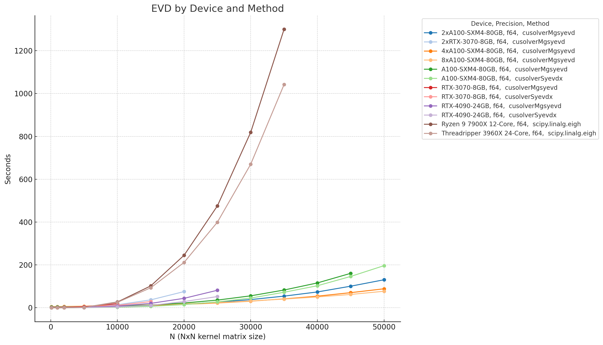
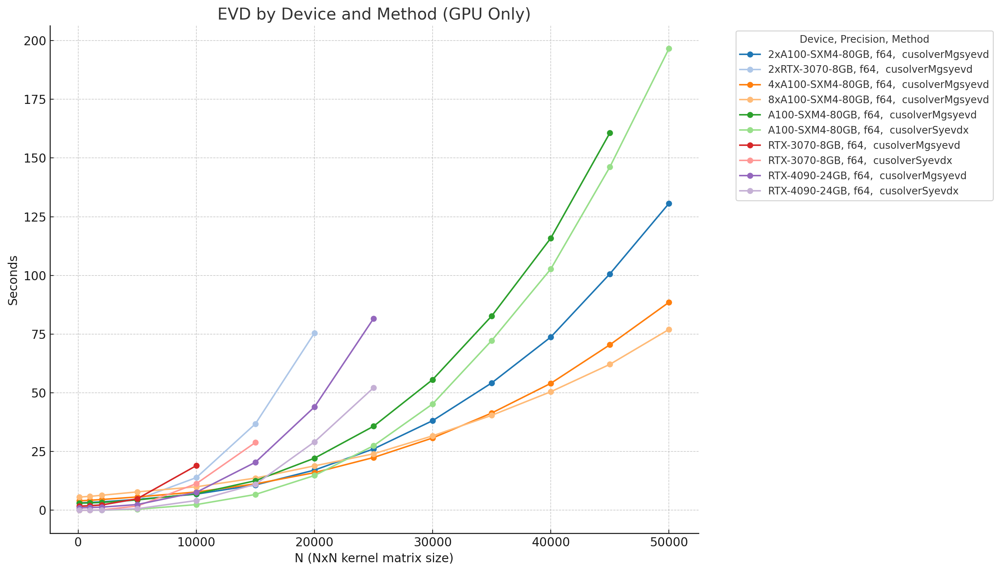
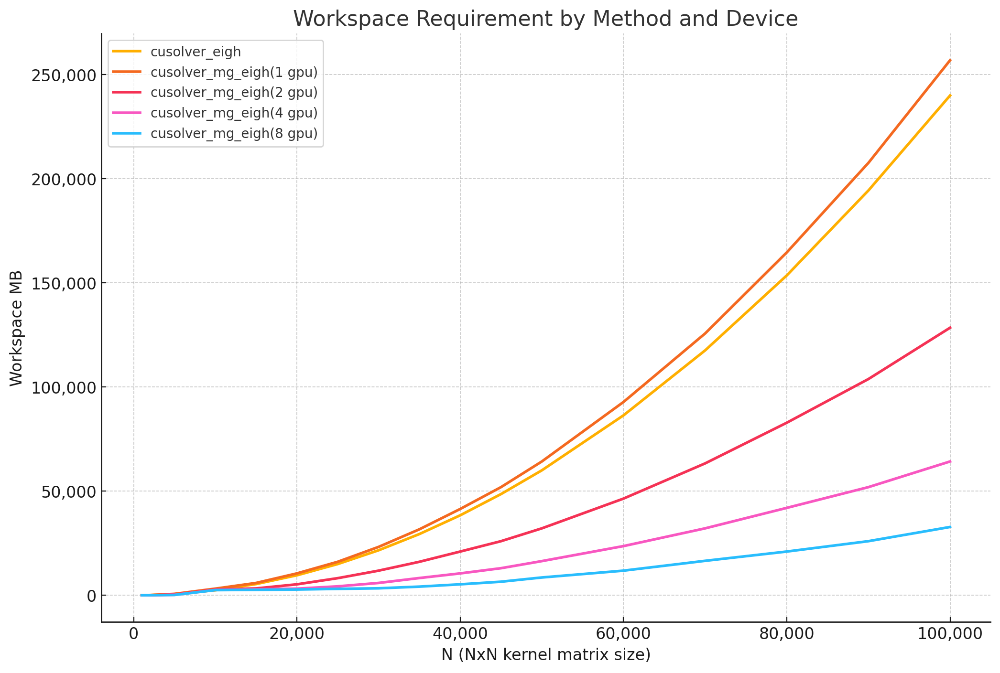

# kernel_tools
Tools for kernel methods for PyTorch and Cuda devices

## Installation

This library uses .cu/.cpp c++ code. It can be installed with `pip install .` or for development with `pip install -e .` You might need to install python development headers and tools like setuptools to get this working.

Installation compiles the .cu/.cpp files and can take a minute or two.

## linalg
Exports two [cuSOLVER](https://docs.nvidia.com/cuda/cusolver/) functions:
* [cusolverDnXsyevdx](https://docs.nvidia.com/cuda/cusolver/#cusolverdnxgesvd)
* [cusolverMgSyevd](https://docs.nvidia.com/cuda/cusolver/#cusolvermgsyevd)

### cusolverDnXsyevdx

This function extracts eigenvalues/eigenvectors by an index. This can extract the top few
eigenvalues/eigenvectors of a system. This function runs on one Nvidia device.

This function is available in this library at `kernel_tools.linalg.cusolver_eigh`

The function to estimate workspace size for a future run is `kernel_tools.linalg.cusolver_eigh_workspace_requirements`.

The workspace does not include the memory necessary to store the matrix.

#### cusolverDnXsyevdx WARNING:

If you request a range of eigenvectors, the code returns a view over the original matrix (or even the 
cloned matrix if overwrite_a is False). This view actually prevents the entire rest of the matrix from
being garbage collected. Instead of doing a clone of this view inside the PyTorch code (out of fear this makes the difference to exceed vram), it is up to the user to clone this view or transfer it back to cpu straight after.

### cusolverMgSyevd

This function extracts all eigenvalues/eigenvectors of a system. This function uses all visible Nvidia devices to split the work and share data across NVlink if available.

This function is available in this library at `kernel_tools.linalg.cusolver_mg_eigh`

The function to estimate workspace size for a future run is `kernel_tools.linalg.cusolver_mg_eigh_workspace_requirements`

The workspace is split between all of the devices, so as you add more devices keeping the N static, the workspace requirement per device goes down. This workspace does not include the memory necessary to store the matrix.

#### cusolverMgSyevd WARNING:
There is currently an issue with reusing the `cusolverMgHandle_t` for multiple runs in the same context. It seems that even destroying the handle and creating a new one has the same issue. The only single process workaround appears to be leaking memory by creating a new handle for each run and leaving the old ones stagnant. This library gets around the bug by spawning a new process with a fresh cuda context for each call in to a cusolverMgHandle_t. This doesn't appear to leak any memory, even with 2,000+ sequential small runs. A bug report was filed to Nvidia, waiting on followup.

### Performance

## Environment Variables

use `export USE_KERNEL_TOOLS_JIT=1` to force use of cpp/cu in JIT mode for development.

use `export USE_KERNEL_TOOLS_JIT=0` or don't export this symbol to fall back to compiled versions.

use `export USE_KERNEL_TOOLS_DEBUG=0` or don't export this symbol to compile cxx and cuda in release mode.

use `export USE_KERNEL_TOOLS_DEBUG=1` to compile cxx and cuda with no optimization. This should compile faster.

use `export USE_KERNEL_TOOLS_VERBOSE=1` to compile cxx and cuda verbose during JIT compilation. This shows your standard compile errors with line numbers in the cpp and cuda files.

use `export USE_KERNEL_TOOLS_VERBOSE=0` or don't export to silence the JIT compilation log lines.